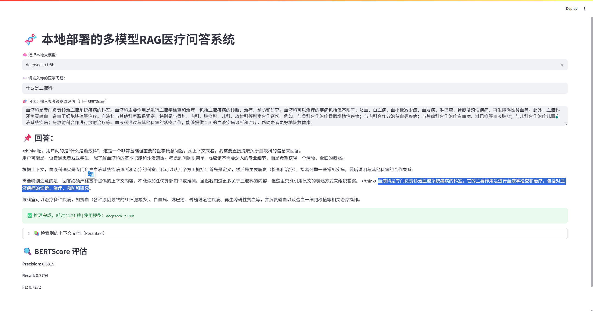

# 🧠 本地 RAG 医疗问答系统

本项目基于本地大语言模型（LLM）、RAG（Retrieval-Augmented Generation）技术实现一个医疗问答系统，集成了向量数据库、文档检索、重排序（Rerank）和 BERTScore 自动评估等模块，支持运行于 **纯本地环境**，无外部 API 调用。

---

## 📌 示例界面截图



---

## ✨ 项目亮点

- ✅ 本地大模型多选：支持 Qwen3、DeepSeek-R1、LLaMA3.1、Gemma3 等
- ✅ RAG 架构：结合知识库增强大模型能力，解决幻觉问题
- ✅ 精确检索：使用 BGE 向量模型 + FAISS 向量数据库
- ✅ 精准排序：集成 BGE-Reranker 文档重排模型
- ✅ 自动评估：支持 **BERTScore** 评价生成内容质量，含可视化分数展示
- ✅ 全程可视化：基于 Streamlit 构建交互式界面
- ✅ 推理时间统计 + 检索上下文展示
- ✅ 全本地部署：无需联网、无需 API KEY、安全可控

---

## 📦 技术栈

| 模块 | 技术 / 模型 |
|------|--------------|
| 大模型 | ChatOllama 本地部署模型（支持 qwen3、deepseek、llama3、gemma） |
| 向量模型 | `BAAI/bge-small-en-v1.5` |
| 向量数据库 | FAISS |
| Reranker | `BAAI/bge-reranker-base` |
| BERTScore | `bert-score` 包 |
| 前端 | Streamlit |
| 开发语言 | Python 3.10+ |

---

## 🚀 使用方式

### 1. 安装依赖

```
bash
pip install -r requirements.txt
```

确保你已经本地部署了 Ollama 并下载好以下模型：

```
bash
ollama pull deepseek-r1:8b
ollama pull qwen3:8b
ollama pull llama3.1:8b
ollama pull gemma3
```

### 2. 构建向量数据库
请先将医学知识文档（TXT、PDF、Markdown 等）放入 ./data/vect_medical_knowledge 目录，并运行预处理脚本生成向量数据库：

bash
```
python scripts/build_vector_store.py
生成的向量索引将保存在：
./data/vect_medical_knowledge
```

### 3. 启动系统
```
bash
streamlit run app.py
```

## 🧪 评估指标
系统支持基于参考答案的自动评价：

### ✅ BERTScore
用户在输入提问后，可以填写“参考答案”，系统会使用 BERTScore 计算生成结果与参考之间的：

Precision（精确度）

Recall（召回率）

F1（综合得分）

适合用于开发调优、模型效果对比、实验记录。

### ✅ 向量召回 Recall
展示 reranker 后选出的文档是否来自初始向量检索结果，衡量 RAG 流程信息保持能力。

## 📂 目录结构简览
```
bash

├── data/
├── app/
├── README.md
└── requirements.txt              # 所有依赖
```

## 🧑‍💻 作者信息

- 👨‍🎓 作者：WangJun
- 📬 联系方式：wangjun1704@bjfu.edu.cn

---

> 若您觉得本项目有帮助，欢迎 ⭐ ！
